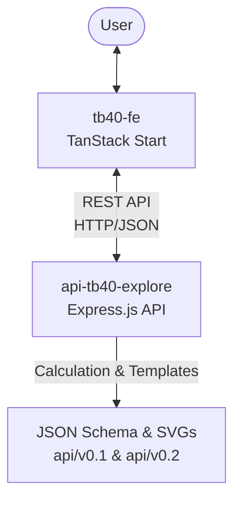
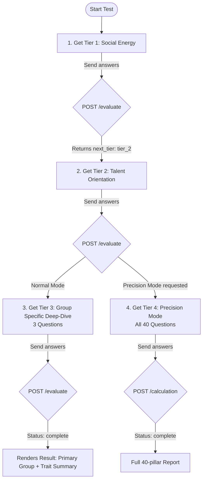

# Tafsir Bakat 40 (TB40) Repository Analysis

This report provides a comprehensive architectural and integration analysis of the two repositories:
1. **Frontend**: [tb40-fe](file:///home/abuhafi/Project/tb40-fe) (React/TanStack Start)
2. **Backend**: [api-tb40-explore](file:///home/abuhafi/Project/api-tb40-explore) (Express.js REST API)

---

## 1. System Overview

**Tafsir Bakat 40 (TB40)** is a personality and character assessment platform. It aligns psychological traits (talent, learning styles, emotional languages) with 40 noble characteristics (*sifat luhur*) derived from the Islamic tradition.

The system is structured as a decoupled frontend-backend architecture:
*   The **Frontend** handles user registration, paginated tests, interactive SVG visualization, and detailed results reporting.
*   The **Backend** acts as a stateless scoring engine that processes answers, performs hierarchical averaging/ranking across groups, generates customized reports, and serves raw SVGs.



---

## 2. Repository Deep Dives

### A. Frontend: `tb40-fe`
A modern web application built on top of **React 19**, **TanStack Start/Router**, and **Tailwind CSS v4**.

#### Key Directories
*   [`src/routes/`](file:///home/abuhafi/Project/tb40-fe/src/routes): Contains the page routes.
    *   [`index.tsx`](file:///home/abuhafi/Project/tb40-fe/src/routes/index.tsx): Landing page, registration form (Name, Age, Nickname selection), and API connectivity checker.
    *   [`test.tsx`](file:///home/abuhafi/Project/tb40-fe/src/routes/test.tsx): Paginated slider-based wizard (8 questions per page) with a customized, multi-step transition animation during submission.
    *   [`result.tsx`](file:///home/abuhafi/Project/tb40-fe/src/routes/result.tsx): Comprehensive results dashboard. Features interactive SVG color injection based on score/rank, filtering by character group (*Nafs*), search, and high-fidelity print/PDF support.
*   [`public/`](file:///home/abuhafi/Project/tb40-fe/public): Holds local mock assets (`questions.json` and `result.json`) used for offline fallback sandbox mode.

#### Key Features & Architecture
1.  **TanStack Router & Start**: Fully typed file-system routing.
2.  **Tailwind CSS v4 & Lucide Icons**: Modern aesthetics with glassmorphism cards, fluid animations, and custom range sliders.
3.  **Local Storage Persistence**: Save user registration data and current progress in real-time, allowing users to resume testing after a refresh.
4.  **Client-Side SVG Recoloring**: Instead of rendering static SVGs, `result.tsx` reads raw SVG XML strings from the API, runs them through the browser's `DOMParser`, dynamically replaces fill colors of SVG nodes matching element IDs (e.g., `id="group.number"`), and injects them back into the DOM using `dangerouslySetInnerHTML`.

---

### B. Backend: `api-tb40-explore`
A production-ready **Node.js/Express** REST API.

#### Key Directories
*   [`app.js`](file:///home/abuhafi/Project/api-tb40-explore/app.js): Core entry point. Features helmet security headers, gzip compression, winston-driven logging, rate limiting (100 requests per 15 mins), and public Swagger docs under `/api-docs`.
*   [`routes/index.js`](file:///home/abuhafi/Project/api-tb40-explore/routes/index.js): Maps API endpoints for v0.1 and v0.2.
*   [`services/`](file:///home/abuhafi/Project/api-tb40-explore/services): Core calculation logic.
    *   [`calculation.js`](file:///home/abuhafi/Project/api-tb40-explore/services/calculation.js): Processes v0.1 requests (hierarchical averaging & sorting).
    *   [`calculation_v2.js`](file:///home/abuhafi/Project/api-tb40-explore/services/calculation_v2.js): Implements v0.2 tiered branching evaluation.
*   [`api/`](file:///home/abuhafi/Project/api-tb40-explore/api): Versioned static resources containing questions metadata, calculation blueprints, and vector SVGs.
*   [`__tests__/`](file:///home/abuhafi/Project/api-tb40-explore/__tests__): Suite of automated tests written using Jest and Supertest.

---

## 3. Data Flows & API Integration

The backend supports two distinct integration versions: **v0.1 (Precision Mode)** and **v0.2 (Tiered Branching)**.

### Version Comparison Table

| Feature | v0.1 API | v0.2 API |
| :--- | :--- | :--- |
| **Flow Type** | Linear (One-shot) | Dynamic branching (State-machine style) |
| **Total Questions** | 40 questions | 5 to 45 questions (adaptive) |
| **Client State** | Simple answers array | Full cumulative `answers` object sent on each step |
| **Key Output** | Averages for groups (2, 3, 6, 18, 40), SVG maps, pre-rendered summary template | Primary trait group, detailed description, subset of traits |
| **Endpoints** | `GET /api/v0.1/:type/questions.json`<br>`POST /api/v0.1/:type/calculation` | `GET /api/v0.2/:type/schema`<br>`POST /api/v0.2/:type/evaluate` |

---

### A. v0.1 Linear Flow (Currently Active in Frontend)

The current frontend implementation is locked to the **v0.1 Flow**:

```mermaid
sequenceDiagram
    participant FE as Frontend (tb40-fe)
    participant BE as Backend (api-tb40-explore)
    
    FE->>BE: GET /api/v0.1/tb40/questions.json
    BE-->>FE: Return list of 40 questions
    Note over FE: User answers 40 questions<br/>Scores 0 - 100
    FE->>BE: POST /api/v0.1/tb40/calculation (Payload: 40 scores + metadata)
    Note over BE: 1. Map scores to Group 40<br/>2. Run average rollups up the lineage:<br/>Group 40 -> 18 -> 6 -> 3 & 2<br/>3. Rank items & assign colors<br/>4. Render textual summary template
    BE-->>FE: Return JSON (tb40Result, tb40ResultRanked, tb40Presentation, SVG XMLs)
    Note over FE: DOMParser processes and recolors SVGs;<br/>Renders report pages
```

---

### B. v0.2 Adaptive Tiered Flow (Supported in Backend)

The v0.2 flow relies on a stateless evaluation loop where the frontend accumulates answers and sends them back to the server to determine the next tier.



#### Detailed v0.2 Branching Mappings
Under the hood, the backend maps the combination of **Tier 2 (Orientasi Bakat: Karsa=1, Cipta=2, Rasa=3)** and **Tier 1 (Energi Sosial: Introvert=1, Extrovert=2)** to target specific groups in Tier 3:

*   `1_1` (Karsa + Introvert) $\rightarrow$ **Pekerja Keras** (`q25`, `q26`, `q4`)
*   `2_1` (Cipta + Introvert) $\rightarrow$ **Cerdik/Cerdas** (`q6`, `q11`, `q8`)
*   `3_1` (Rasa + Introvert) $\rightarrow$ **Berperasaan** (`q10`, `q29`, `q40`)
*   `1_2` (Karsa + Extrovert) $\rightarrow$ **Tegas** (`q35`, `q22`, `q9`)
*   `2_2` (Cipta + Extrovert) $\rightarrow$ **Mudah Bergaul** (`q38`, `q36`, `q23`)
*   `3_2` (Rasa + Extrovert) $\rightarrow$ **Lembut** (`q5`, `q17`, `q30`)

---

## 4. Key Observations & Opportunities

1.  **Frontend-Backend Version Drift**: 
    The frontend is fully designed for v0.1 (40 linear questions). Although the backend supports the v0.2 branching logic, the frontend does not yet utilize these endpoints (`/schema`, `/evaluate`). There is a major opportunity to implement a tiered assessment flow toggle in the UI.
2.  **Fallback Resiliency**:
    The frontend has robust fallback capabilities: if the live API server is down, it seamlessly transitions into a local mock sandbox using static `questions.json` and `result.json` assets from the public directory.
3.  **Client-Side Rendering Quality**:
    The frontend SVG handler dynamically recolors inline elements rather than rendering static pictures, giving the app high-fidelity vectors that resize cleanly for mobile screens and print layouts.
