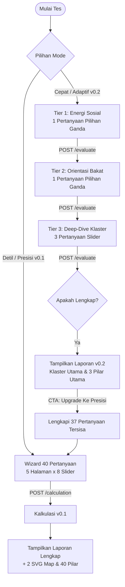

# Panduan Implementasi API v0.2 (Tiered Assessment) Pada Frontend

Dokumen ini menjelaskan strategi teknis dan panduan langkah demi langkah untuk mengimplementasikan **v0.2 Tiered Assessment (Penilaian Adaptif Bercabang)** ke dalam [tb40-fe](file:///home/abuhafi/Project/tb40-fe) dengan tetap mempertahankan opsi **v0.1 Precision Assessment (Akurasi Penuh 40 Pilar)**.

---

## 1. Konsep Dasar & Arsitektur Aliran

API v0.2 bersifat **stateless**. Ini berarti frontend bertanggung jawab menyimpan status jawaban sementara dan mengirimkan seluruh objek jawaban di setiap langkah ke endpoint `/api/v0.2/:type/evaluate`. Backend kemudian akan mengevaluasi status saat ini dan memberi tahu langkah atau pertanyaan berikutnya yang harus ditampilkan.

### Perbandingan Aliran Pengguna



---

## 2. Strategi Langkah Demi Langkah

### Langkah 1: Tambahkan Pilihan Mode pada Landing Page (`index.tsx`)

Pada [`src/routes/index.tsx`](file:///home/abuhafi/Project/tb40-fe/src/routes/index.tsx), tambahkan selektor mode penilaian pada formulir pendaftaran:
*   **Mode Cepat (Adaptif)**: Menggunakan v0.2 (hanya ~5 pertanyaan). Cocok untuk pengguna yang ingin ringkasan cepat.
*   **Mode Detil (Presisi)**: Menggunakan v0.1 (40 pertanyaan penuh). Cocok untuk laporan formal/cetak.

Simpan pilihan mode ini ke dalam objek `umum` di `localStorage`:
```typescript
const umumData = {
  // ... data nama, usia, dll
  testMode: testMode, // "adaptive" | "precision"
  apiType,
}
```

---

### Langkah 2: Refaktorisasi State Machine pada Wizard (`test.tsx`)

Pada [`src/routes/test.tsx`](file:///home/abuhafi/Project/tb40-fe/src/routes/test.tsx), buat state baru untuk menampung format jawaban v0.2 yang terstruktur:

```typescript
// State Jawaban v0.2
interface AnswerStateV2 {
  tier_1?: number; // 1 = Introvert, 2 = Extrovert
  tier_2?: number; // 1 = Karsa, 2 = Cipta, 3 = Rasa
  tier_3?: Record<string, number>; // Contoh: { q25: 80, q26: 70, q4: 90 }
}

const [answersV2, setAnswersV2] = useState<AnswerStateV2>({});
const [currentTier, setCurrentTier] = useState<"tier_1" | "tier_2" | "tier_3" | "tier_4" | null>(null);
const [currentQuestions, setCurrentQuestions] = useState<any[]>([]);
const [assessmentStatus, setAssessmentStatus] = useState<"incomplete" | "analyzing" | "complete" | "precision_requested">("incomplete");
```

#### Fungsi Evaluasi Langkah (Evaluation Loop)
Buat fungsi helper untuk melakukan evaluasi stateless ke API backend:

```typescript
const evaluateProgress = async (updatedAnswers: AnswerStateV2) => {
  setIsLoading(true);
  try {
    const response = await fetch(`${API_URL}/api/v0.2/${assessmentType}/evaluate`, {
      method: "POST",
      headers: { "Content-Type": "application/json" },
      body: JSON.stringify({ answers: updatedAnswers }),
    });
    
    if (!response.ok) throw new Error("Gagal mengevaluasi kemajuan tes");
    const data = await response.ok ? await response.json() : null;
    
    setAssessmentStatus(data.status);
    setCurrentTier(data.next_tier);
    
    if (data.status === "complete") {
      // Simpan hasil evaluasi dan arahkan ke halaman hasil
      localStorage.setItem("tb40_result", JSON.stringify({ version: "v0.2", ...data.result }));
      navigate({ to: "/result" });
    } else {
      // Set pertanyaan yang dikembalikan oleh API untuk ditampilkan di UI
      setCurrentQuestions(data.questions || []);
    }
  } catch (err) {
    console.error(err);
    setErrorMsg("Gagal menghubungi server penilaian. Silakan coba lagi.");
  } finally {
    setIsLoading(false);
  }
};
```

---

### Langkah 3: Render Antarmuka UI Dinamis Berdasarkan Tier

Rancang komponen pertanyaan di [`test.tsx`](file:///home/abuhafi/Project/tb40-fe/src/routes/test.tsx) agar merender elemen visual yang sesuai dengan tipe tier:

#### A. Tier 1 (Binary - Energi Sosial)
Tampilkan 2 opsi kartu visual premium yang responsif dengan ikon menarik (misal: *Home* untuk Introvert, *Users* untuk Extrovert):
```tsx
if (currentTier === "tier_1") {
  return (
    <div className="flex flex-col gap-6">
      <h3 className="font-heading font-medium text-lg text-center">Energi Sosial Anda</h3>
      <p className="text-muted-foreground text-sm text-center">Bagaimana Anda memulihkan dan mendapatkan energi mental Anda?</p>
      
      <div className="grid grid-cols-1 md:grid-cols-2 gap-4">
        <button
          onClick={() => handleSelectTier1(1)} // 1 = Introvert
          className="border border-border p-6 rounded-2xl hover:border-primary/50 text-left bg-card hover:bg-muted/10 transition-all cursor-pointer"
        >
          <h4 className="font-semibold text-foreground">Introvert</h4>
          <p className="text-xs text-muted-foreground mt-2">Merasa lebih nyaman, fokus, dan terisi energinya ketika merenung atau menghabiskan waktu sendiri.</p>
        </button>
        <button
          onClick={() => handleSelectTier1(2)} // 2 = Extrovert
          className="border border-border p-6 rounded-2xl hover:border-primary/50 text-left bg-card hover:bg-muted/10 transition-all cursor-pointer"
        >
          <h4 className="font-semibold text-foreground">Extrovert</h4>
          <p className="text-xs text-muted-foreground mt-2">Merasa lebih bersemangat, ceria, dan termotivasi ketika berinteraksi dalam kelompok sosial atau banyak orang.</p>
        </button>
      </div>
    </div>
  );
}
```

#### B. Tier 2 (Ternary - Orientasi Bakat)
Tampilkan 3 opsi kartu visual untuk Karsa, Cipta, dan Rasa:
```tsx
if (currentTier === "tier_2") {
  return (
    <div className="flex flex-col gap-6">
      <h3 className="font-heading font-medium text-lg text-center">Orientasi Kekuatan Diri</h3>
      <p className="text-muted-foreground text-sm text-center">Manakah dimensi tindakan yang paling dominan menggambarkan diri Anda sehari-hari?</p>
      
      <div className="grid grid-cols-1 md:grid-cols-3 gap-4">
        {/* Karsa Card */}
        <button onClick={() => handleSelectTier2(1)} className="border border-border p-6 rounded-2xl text-left bg-card hover:border-primary/50 cursor-pointer">
          <h4 className="font-semibold text-primary">Karsa (Aksi / Kerja Fisik)</h4>
          <p className="text-xs text-muted-foreground mt-2">Segera bertindak, bertekad kuat menyelesaikan target, dan menyukai gerak aktifitas fisik nyata.</p>
        </button>
        {/* Cipta Card */}
        <button onClick={() => handleSelectTier2(2)} className="border border-border p-6 rounded-2xl text-left bg-card hover:border-primary/50 cursor-pointer">
          <h4 className="font-semibold text-primary">Cipta (Pikir / Analitis)</h4>
          <p className="text-xs text-muted-foreground mt-2">Menganalisis detail secara mendalam, membuat rencana strategis, menyerap ilmu visual/teori.</p>
        </button>
        {/* Rasa Card */}
        <button onClick={() => handleSelectTier2(3)} className="border border-border p-6 rounded-2xl text-left bg-card hover:border-primary/50 cursor-pointer">
          <h4 className="font-semibold text-primary">Rasa (Hati / Emosi)</h4>
          <p className="text-xs text-muted-foreground mt-2">Sangat sensitif terhadap perasaan sesama, senang mengayomi, mengedepankan empati sosial.</p>
        </button>
      </div>
    </div>
  );
}
```

#### C. Tier 3 (Group-Specific Sliders)
Gunakan kembali slider yang ada dari v0.1 untuk mengumpulkan skor presisi (0-100) dari 3 pertanyaan spesifik yang ditentukan backend berdasarkan kelompok bakat dasar Anda.

---

### Langkah 4: Tampilan Hasil Adaptif (`result.tsx`)

Karena **Mode Cepat (v0.2)** hanya mengevaluasi **3 pilar utama** (bukan 40), grafik pemetaan SVG dan pilar detail tidak dapat ditampilkan secara penuh (skor untuk pilar lainnya tidak tersedia). 

Modifikasi [`src/routes/result.tsx`](file:///home/abuhafi/Project/tb40-fe/src/routes/result.tsx) untuk mendeteksi tipe hasil:

1.  **Jika Hasil adalah v0.2 (Adaptif)**:
    *   Sembunyikan bagian SVG Pemetaan Bakat dan daftar lengkap 40 Pilar.
    *   Tampilkan kartu ringkasan premium yang menonjolkan **Klaster Utama** hasil evaluasi (contoh: "Pekerja Keras", "Cerdas", "Gaul").
    *   Tampilkan rincian penjelasan dari 3 pilar yang dievaluasi.
    *   **CTA Upgrade Penting**: Tampilkan spanduk / kartu promo yang berbunyi:
        > 💡 *Ingin melihat visualisasi Peta Bakat 40 secara lengkap dan rincian seluruh 40 pilar karakter mulia Anda?*
        > 
        > Klik tombol **"Lengkapi Penilaian Presisi"** untuk menjawab 37 pertanyaan tersisa tanpa mengulang dari awal.
2.  **Mekanisme Transisi / Upgrade**:
    *   Saat tombol upgrade ditekan, frontend memanggil `/api/v0.2/tb40/evaluate` dengan menyertakan opsi `request_precision: true`.
    *   API akan merespons dengan `status: "precision_requested"` dan memberikan daftar 40 pertanyaan lengkap.
    *   Frontend memigrasikan status pengujian ke `testMode: "precision"`, memuat seluruh pertanyaan ke dalam editor slider, dan mengizinkan pengguna melengkapi sisa kuesioner.

---

## 3. Penanganan Offline Sandbox (Fallback)

Untuk menjamin aplikasi tetap berjalan saat live server mati/offline, tambahkan mock evaluasi v0.2 di frontend.
Simpan schema pertanyaan v0.2 statis di [`public/questions_v2.json`](file:///home/abuhafi/Project/tb40-fe/public/questions_v2.json) yang mereplikasi data percabangan dari API v0.2, lalu lakukan simulasi state-machine di client-side fallback `test.tsx`.
