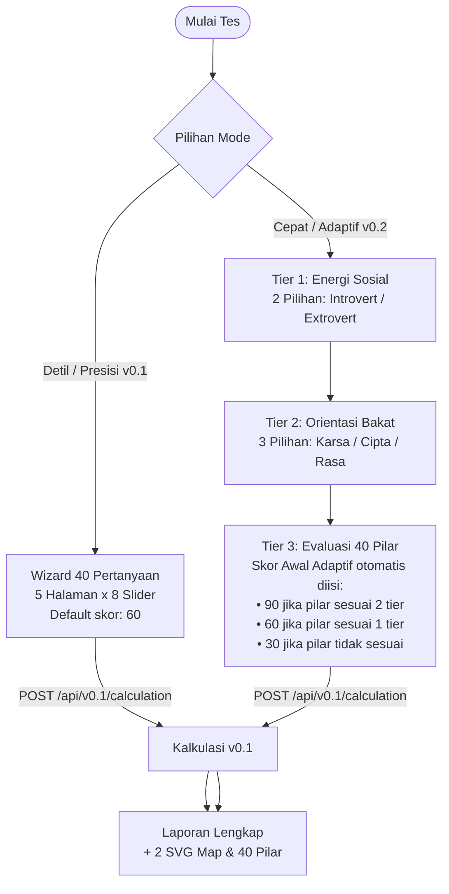

# Panduan Implementasi API v0.2 (Tiered Assessment) Pada Frontend

Dokumen ini menjelaskan strategi teknis dan panduan lengkap untuk implementasi **v0.2 Tiered Assessment (Penilaian Adaptif Bercabang)** ke dalam [tb40-fe](file:///home/abuhafi/Project/tb40-fe) dengan tetap mempertahankan opsi **v0.1 Precision Assessment (Akurasi Penuh 40 Pilar)**.

---

## 1. Konsep Dasar & Arsitektur Aliran

API v0.2 menggunakan 3 tier pertanyaan adaptif untuk **menentukan profil awal**, lalu secara otomatis menetapkan skor default untuk semua 40 pilar berdasarkan profil tersebut. Pengguna kemudian dapat **mengkonfirmasi atau menyesuaikan** skor setiap pilar sebelum menghasilkan laporan penuh.

### Hirarki Data TB40

Sistem bakat TB40 memiliki 5 tingkatan hierarki:

```
G2 (2 pillar)  →  Introvert / Extrovert
G3 (3 pillar)  →  Karsa / Cipta / Rasa  
G6 (6 pillar)  →  Bekerja Keras | Berpikir | Berperasaan | Mempengaruhi | Bekerjasama | Melayani
G18 (18 pillar) → Sub-kategori dari G6 (3 per G6)
G40 (40 pilar)  → Pilar karakter final (2-3 per G18)
```

**Pemetaan G6 → G3 + G2:**

| G6 No | Nama | G3 (Karsa/Cipta/Rasa) | G2 (Intro/Extro) |
|-------|------|----------------------|-----------------|
| 1 | Bekerja Keras | 1 = Karsa | 1 = Introvert |
| 2 | Berpikir | 2 = Cipta | 1 = Introvert |
| 3 | Berperasaan | 3 = Rasa | 1 = Introvert |
| 4 | Mempengaruhi | 1 = Karsa | 2 = Extrovert |
| 5 | Bekerjasama | 2 = Cipta | 2 = Extrovert |
| 6 | Melayani | 3 = Rasa | 2 = Extrovert |

### Perbandingan Aliran Pengguna



---

## 2. Logika Skor Awal Adaptif (Smart Defaults)

Setelah pengguna menjawab Tier 1 dan Tier 2, sistem otomatis menghitung **skor awal (default)** untuk semua 40 pilar berdasarkan kesesuaian hierarki pilar dengan pilihan tier:

### Aturan Penentuan Skor Default

```typescript
/**
 * Hitung default score untuk satu pertanyaan berdasarkan jawaban tier_1 dan tier_2.
 * 
 * @param questionIndex - index pertanyaan (1-40)
 * @param tier1         - pilihan Introvert (1) atau Extrovert (2)  
 * @param tier2         - pilihan Karsa (1), Cipta (2), atau Rasa (3)
 * @returns 90 | 60 | 30
 */
function computeDefaultScore(questionIndex: number, tier1: number, tier2: number): number {
  const g18No = Q_TO_G18[questionIndex]    // Pilar G18 dari pertanyaan ini
  const g6No = G18_TO_G6[g18No]           // Pilar G6 parent dari G18
  const g6Info = G6_PARENT_MAP[g6No]      // Info G6 (g2 dan g3)

  const matchesG2 = g6Info.g2 === tier1   // Cocok dengan Intro/Extro?
  const matchesG3 = g6Info.g3 === tier2   // Cocok dengan Karsa/Cipta/Rasa?

  if (matchesG2 && matchesG3) return 90   // Bakat Utama: kedua dimensi cocok
  if (matchesG2 || matchesG3) return 60   // Bakat Pendukung: satu dimensi cocok
  return 30                                // Bakat Pelengkap: tidak ada yang cocok
}
```

### Mapping Q ke G18 (Q_TO_G18)

```typescript
const Q_TO_G18: Record<number, number> = {
  1: 13, 2: 18, 3: 18, 4: 3,  5: 14,
  6: 6,  7: 11, 8: 4,  9: 10, 10: 9,
  11: 6, 12: 18,13: 1, 14: 5, 15: 8,
  16: 1, 17: 16,18: 2, 19: 12,20: 17,
  21: 16,22: 10,23: 14,24: 11,25: 3,
  26: 4, 27: 12,28: 9, 29: 15,30: 15,
  31: 17,32: 9, 33: 8, 34: 7, 35: 10,
  36: 13,37: 18,38: 13,39: 13,40: 2,
}
```

---

## 3. Aliran State Machine (test.tsx)

### State v0.2 Adaptif

```typescript
const [answersV2, setAnswersV2] = useState<any>({}) // { tier_1: number, tier_2: number }
const [currentTier, setCurrentTier] = useState<"tier_1" | "tier_2" | "tier_3" | null>("tier_1")
const [v2AllQuestions, setV2AllQuestions] = useState<Question[]>([])  // semua 40 pertanyaan
const [v2Answers, setV2Answers] = useState<number[]>([])  // skor[0..39] dengan smart defaults
const [v2Page, setV2Page] = useState(0)  // halaman tier 3 (0-4)
```

### Transisi Tier

| Dari | Ke | Trigger | Aksi |
|------|-----|---------|------|
| - | Tier 1 | Mulai tes | Load schema v0.2 |
| Tier 1 | Tier 2 | Pilih Introvert/Extrovert | Simpan `tier_1`, hapus tier_2 & tier_3 |
| Tier 2 | Tier 3 | Pilih Karsa/Cipta/Rasa | Hitung smart defaults, load semua 40 pertanyaan |
| Tier 3 (page n) | Tier 3 (page n+1) | Klik Lanjut | Paginasi |
| Tier 3 (page 4) | Submit | Klik Mulai Analisa | POST ke /api/v0.1/calculation |

---

## 4. Submit & Kalkulasi (v0.1 Endpoint)

Setelah pengguna menyelesaikan Tier 3, frontend mengirimkan **seluruh 40 skor** (smart defaults + override user) ke endpoint kalkulasi v0.1:

```typescript
const submitV2Test = async () => {
  const fullAnswers = v2Answers  // array[40] dari smart defaults + overrides user

  const payload = {
    parts: {
      umum: { nama, usia, lahir, tanggal },
      [type]: fullAnswers,  // "tb40" atau "tb40anak"
    },
  }

  const response = await fetch(`${apiUrl}/api/v0.1/${type}/calculation`, {
    method: "POST",
    headers: { "Content-Type": "application/json" },
    body: JSON.stringify(payload),
  })
  
  // Hasil adalah laporan lengkap v0.1 (tb40Result, tb40ResultRanked, tb40Presentation)
  localStorage.setItem("tb40_result", JSON.stringify(resultData))
  navigate({ to: "/result" })
}
```

---

## 5. Tampilan UI di Tier 3

Tier 3 menampilkan badge informatif untuk setiap pilar:

- **Bakat Utama** (skor default 90) — badge teal — klaster sesuai kedua dimensi
- **Bakat Pendukung** (skor default 60) — badge amber — klaster sesuai satu dimensi
- **Bakat Pelengkap** (skor default 30) — badge slate — klaster tidak sesuai

Setiap pertanyaan juga menampilkan:
- Label **kategori G6** (contoh: "Bekerja Keras", "Berpikir", "Melayani")
- Slider range 0-100 dengan nilai awal dari smart default
- Badge skor real-time ("Bakat Kuat: 80", "Kelemahan Potensial: 35", dll.)

---

## 6. Tampilan Hasil (result.tsx)

Karena v0.2 kini menghasilkan laporan lengkap v0.1, halaman hasil **identik** untuk kedua mode. Pengguna mendapatkan:

- Peta SVG visualisasi bakat (skor dan ranking)
- Ringkasan 3 dimensi (Karsa, Cipta, Rasa)
- Gaya belajar dan bahasa hati
- Rincian lengkap 40 pilar dengan definisi dan potensi lalai/berlebihan

---

## 7. Penanganan Offline / Fallback

Jika server tidak tersedia, sistem fallback ke:
1. `public/questions.json` — untuk memuat semua 40 pertanyaan di Tier 3
2. `public/result.json` — untuk simulasi kalkulasi lokal

State `apiType === "mock"` menunjukkan mode offline aktif.

---

## 8. Perbedaan v0.1 vs v0.2 (Ringkasan)

| Aspek | v0.1 (Presisi) | v0.2 (Adaptif) |
|-------|---------------|----------------|
| Jumlah pertanyaan slider | 40 | 40 |
| Default skor awal | 60 (flat) | 30/60/90 (smart, berbasis tier) |
| Pertanyaan pilihan ganda | 0 | 2 (Tier 1 + Tier 2) |
| Paginasi slider | 5 halaman | 5 halaman |
| Endpoint submit | `/api/v0.1/calculation` | `/api/v0.1/calculation` |
| Format hasil | Full v0.1 | Full v0.1 (identik) |
| Estimasi waktu | ~10-15 menit | ~3-7 menit (dengan default) |
